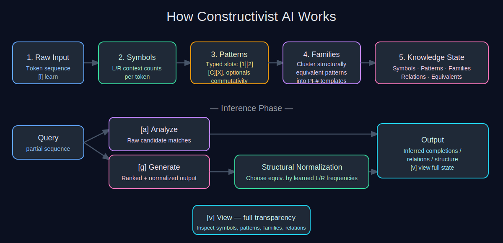
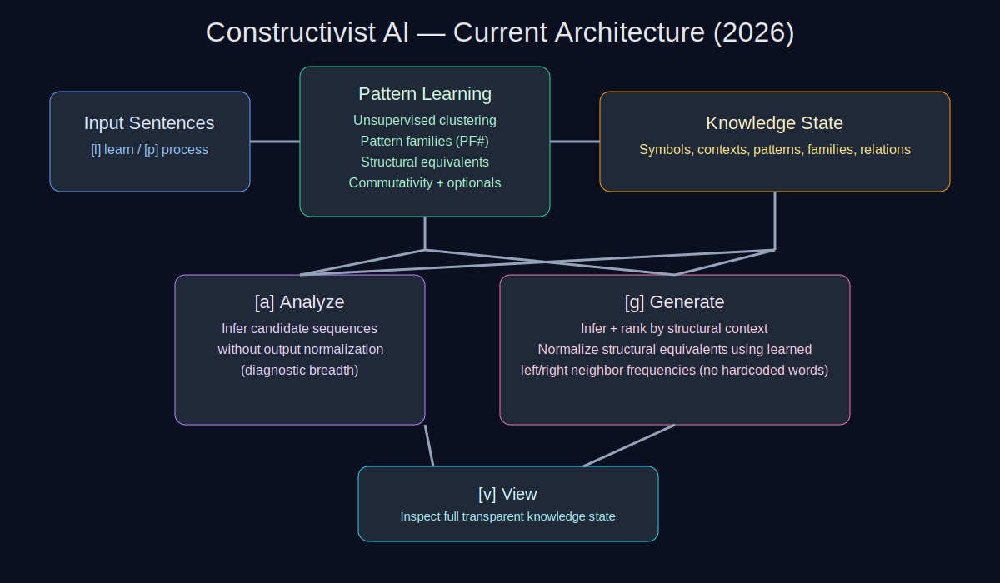
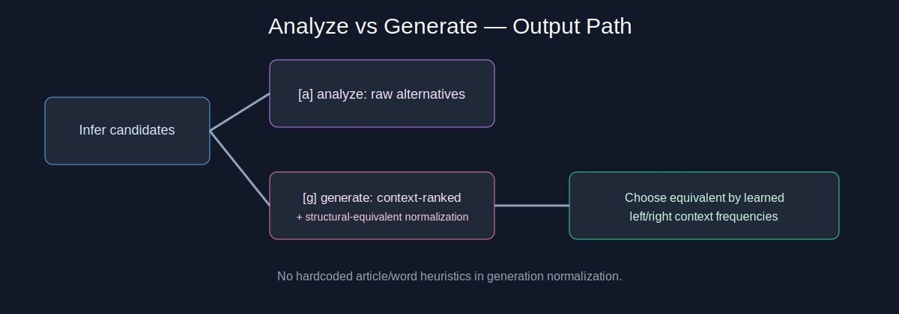

## Constructivist AI

**A symbolic research prototype for learning relational structure from sequences**

[](LICENSE)
[]()
[](https://openjdk.org/)

## What this is (currently)

Constructivist AI is a **transparent symbolic learning system**.
It learns from token sequences and builds explicit structures:

- symbols with left/right context frequencies,
- relation patterns,
- pattern families (`PF#`) with structural slots,
- structural equivalents (tokens that occupy equivalent structural roles),
- commutative/non-commutative relation behavior.

It is an experimental cognitive-architecture implementation focused on **inspectable reasoning**, not black-box prediction.

## What this is not yet

This project is **not yet**:

- a production NLP system,
- a probabilistic language model,
- robust to noisy spelling/typos/paraphrase,
- benchmarked against modern ML baselines,
- equipped with full linguistic preprocessing.

Matching is still mostly exact-token and research-oriented.

## Current command interface

The current CLI commands are:

`[l]earn, [p]rocess, [a]nalyze, [g]enerate, [v]iew, [q]uit`

### Command behavior highlights

- **`a / analyze`**: inference with broader/raw alternatives (non-normalized output path).
- **`g / generate`**: inference plus output normalization/ranking.
- Generation normalization now chooses structural equivalents via **learned context frequencies** (left/right neighbor usage), rather than hardcoded word rules.

## Potential applications

Because Constructivist AI learns explicit symbolic structure from sequences, it can apply wherever **interpretable pattern reasoning** matters more than raw statistical prediction:

| Domain | How it fits |
|---|---|
| **Education / tutoring** | Recognise structural equivalence in student answers; provide feedback on whether the *structure* of a response is correct, not just the words. |
| **Code completion / refactoring** | Learn syntactic patterns from a small codebase and suggest structurally equivalent completions without a large pre-trained model. |
| **Clinical / scientific text** | Extract relational structure from domain-specific corpora where black-box models are hard to audit. |
| **Formal language analysis** | Mine grammar rules or protocol structures from logs/traces in a fully transparent, inspectable way. |
| **Anomaly detection** | Flag sequences that do not fit any learned pattern family — useful in network security, manufacturing QA, or medical monitoring. |
| **Cognitive-science research** | Use as a controlled, fully-observable testbed for constructivist theories of learning and knowledge formation. |
| **Low-resource NLP** | Apply to languages or specialized vocabularies where large corpora do not exist; the system learns from tens of examples, not millions. |
| **Knowledge-graph bootstrapping** | Seed a knowledge graph with relation triples discovered from unstructured text without supervised annotation. |

## How it works

Constructivist AI processes token sequences in two phases:

**Learning phase** (`l` / `p`):
1. Every token is registered as a **Symbol** with left/right context frequency counts.
2. Co-occurring token pairs become **relation patterns** with commutativity detection.
3. Patterns are generalized — slots (`[1]`, `[2]`, `[C]`, `[X]`) replace interchangeable tokens, and optional parts are flagged.
4. Structurally equivalent patterns are grouped into reusable **pattern families** (`PF#`).

**Inference phase** (`a` / `g`):
- A query sequence is matched against known patterns and families.
- `[a]nalyze` returns raw candidate completions — diagnostic breadth, no filtering.
- `[g]enerate` ranks candidates and selects the best structural equivalent by learned left/right neighbor frequencies — no hardcoded word heuristics.
- `[v]iew` exposes the full knowledge state at any time for inspection.

### How it works — diagram



## Architecture snapshots

### 1) Current system architecture



### 2) Analyze vs Generate path



## Core capabilities

1. **Explicit pattern representation** with typed placeholders (`[1]`, `[2]`, `[C]`, `[X]`, `PF#`).
2. **Structural equivalence discovery** from usage context.
3. **Pattern family grouping** and reusable structural templates.
4. **Commutativity-aware reasoning** for relation inference.
5. **Transparent introspection** via `[v]iew` (symbols, patterns, families, relations).

## Build and run

### Prerequisites

- Java 7 or higher
- `inotify-tools` (Linux only, needed for `watch.sh` auto-rebuild — optional)

### Compile

```bash
javac -d bin $(find java -name "*.java" | tr '\n' ' ')
```

### Build `constructivist_source.jar` (manual)

```bash
./build.sh
```

Compiles all sources under `java/` and packages them into `constructivist_source.jar`.

### Build and run immediately

```bash
./build.sh run
```

### Auto-rebuild on source change

```bash
./watch.sh
```

Watches `java/` for any `.java` file change and rebuilds `constructivist_source.jar` automatically.  
Requires `inotify-tools` (`sudo apt-get install inotify-tools` on Debian/Ubuntu).

### Run the JAR directly

```bash
java -jar constructivist_source.jar
```

### Run main CLI (from compiled classes)

```bash
java -cp bin danexcodr.ai.Main
```

### Run scripted harness

```bash
java -cp bin danexcodr.ai.Test
```

## Changelog

Project history is tracked in [CHANGELOG.md](CHANGELOG.md).

## Research context

This repository explores a constructivist approach: learning explicit structures first, then using discovered structural properties to improve future learning and generation behavior.

## License

MIT License - see [LICENSE](./LICENSE).

## Author

[DanexCodr](https://github.com/DanexCodr)
